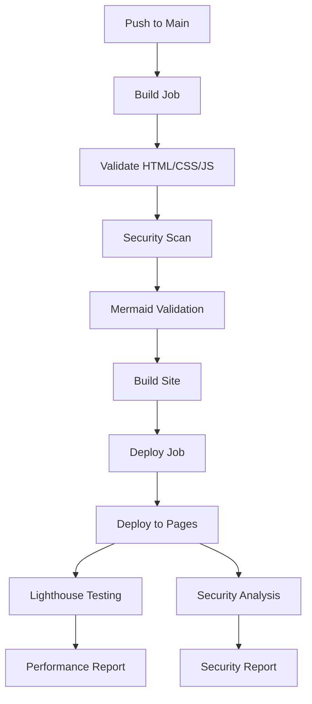

# 🚀 Deployment Guide - Architecture Diagrams to GitHub Pages

This guide walks you through deploying your Architecture Diagrams Collection website to GitHub Pages using the automated CI/CD pipeline.

## 📋 Prerequisites

- GitHub account
- Git installed locally
- Repository with the architecture diagrams code

## 🛠️ Setup Steps

### 1. Repository Setup

```bash
# Clone your repository (if not already done)
git clone https://github.com/your-username/architecture-diagrams.git
cd architecture-diagrams

# Ensure all files are committed
git add .
git commit -m "Initial commit with architecture diagrams website"
git push origin main
```

### 2. GitHub Pages Configuration

1. **Navigate to Repository Settings**
   - Go to your GitHub repository
   - Click on **Settings** tab
   - Scroll down to **Pages** section in the left sidebar

2. **Configure Pages Source**
   - **Source**: Select "GitHub Actions"
   - This allows the CI/CD pipeline to deploy automatically

3. **Update Repository URLs**
   - Edit `_config.yml`:
     ```yaml
     url: "https://your-username.github.io"
     baseurl: "/architecture-diagrams"
     github_username: your-username
     repository: your-username/architecture-diagrams
     ```
   
   - Edit `index.html` and update the GitHub link:
     ```html
     <a href="https://github.com/your-username/architecture-diagrams" class="github-link" target="_blank">
     ```

### 3. CI/CD Pipeline Features

The GitHub Actions workflow includes:

#### 🔍 **Build & Validation**
- HTML structure validation
- CSS syntax checking
- JavaScript linting
- Mermaid diagram syntax validation
- Security scanning for secrets and vulnerabilities
- File size optimization checks
- Code formatting validation

#### 🚀 **Deployment**
- Automatic deployment to GitHub Pages
- Sitemap generation for SEO
- Robots.txt creation
- Production optimization

#### 📊 **Quality Assurance**
- Lighthouse performance testing
- Accessibility compliance checks
- SEO optimization validation
- Security vulnerability scanning

### 4. Triggering Deployment

The pipeline automatically triggers on:

- **Push to main branch** (automatic deployment)
- **Pull requests** (validation only)
- **Manual trigger** (from GitHub Actions tab)

```bash
# Deploy new changes
git add .
git commit -m "Add new architecture diagram"
git push origin main
```

## 📊 Pipeline Overview



## 🔧 Monitoring & Troubleshooting

### Viewing Pipeline Status

1. **Go to Actions Tab**
   - Visit your repository on GitHub
   - Click **Actions** tab
   - View running/completed workflows

2. **Check Deployment Status**
   - Green checkmark = Successful deployment
   - Red X = Failed deployment (check logs)
   - Yellow dot = In progress

### Common Issues & Solutions

#### ❌ **Deployment Failed**
```bash
# Check workflow logs in GitHub Actions
# Common fixes:
1. Ensure _config.yml has correct URLs
2. Check for syntax errors in HTML/CSS/JS
3. Verify file permissions
```

#### ❌ **Pages Not Loading**
```bash
# Verify Pages settings:
1. Settings → Pages → Source: "GitHub Actions"
2. Check if custom domain is configured correctly
3. Wait 5-10 minutes after first deployment
```

#### ❌ **Lighthouse Failures**
```bash
# Performance issues:
1. Check file sizes (keep JS/CSS under 100KB)
2. Optimize images
3. Review Lighthouse report in Action logs
```

### 📈 Performance Thresholds

The pipeline enforces these quality gates:

- **Performance**: ≥ 85%
- **Accessibility**: ≥ 95% (required)
- **Best Practices**: ≥ 85%
- **SEO**: ≥ 85%
- **PWA**: ≥ 70%

## 🔒 Security Features

### Automated Security Checks

- **Secret Scanning**: Detects API keys, passwords, tokens
- **Vulnerability Detection**: Checks for common web vulnerabilities
- **Content Security**: Validates against XSS and injection attacks
- **HTTPS Enforcement**: Ensures all links use secure protocols

### Security Best Practices

```yaml
# The pipeline automatically:
✅ Scans for hardcoded secrets
✅ Checks for inline JavaScript
✅ Validates HTTPS usage
✅ Monitors file integrity
```

## 🌐 Custom Domain Setup (Optional)

### 1. Add CNAME File
```bash
# Create CNAME file in repository root
echo "your-domain.com" > CNAME
git add CNAME
git commit -m "Add custom domain"
git push origin main
```

### 2. DNS Configuration
```bash
# Add DNS records:
CNAME: your-domain.com → your-username.github.io
```

### 3. Update Configuration
```yaml
# Update _config.yml
url: "https://your-domain.com"
baseurl: ""
```

## 📊 Deployment Timeline

```
Push to Main → Build (2-3 min) → Deploy (1-2 min) → Live (30 sec)
Total Time: ~5 minutes
```

## 🔄 Manual Deployment

If you need to trigger deployment manually:

1. **Via GitHub UI**
   - Go to Actions tab
   - Select "Deploy Architecture Diagrams to GitHub Pages"
   - Click "Run workflow"
   - Select branch and click "Run workflow"

2. **Via API** (for advanced users)
   ```bash
   curl -X POST \
     -H "Accept: application/vnd.github.v3+json" \
     -H "Authorization: token YOUR_TOKEN" \
     https://api.github.com/repos/your-username/architecture-diagrams/actions/workflows/deploy-to-pages.yml/dispatches \
     -d '{"ref":"main"}'
   ```

## 📈 Analytics & Monitoring

### Built-in Monitoring
- **Build Success Rate**: View in Actions dashboard
- **Deployment Time**: Tracked in workflow logs
- **Performance Metrics**: Lighthouse reports
- **Error Tracking**: Failed build notifications

### Optional Enhancements
```yaml
# Add to _config.yml for Google Analytics
google_analytics: "GA_TRACKING_ID"
```

## 🆘 Support & Resources

### Quick Links
- **Live Site**: `https://your-username.github.io/architecture-diagrams`
- **Repository**: `https://github.com/your-username/architecture-diagrams`
- **Actions**: `https://github.com/your-username/architecture-diagrams/actions`
- **Issues**: `https://github.com/your-username/architecture-diagrams/issues`

### Getting Help
1. **Check Action Logs**: Most issues are logged in the workflow
2. **GitHub Pages Status**: Check GitHub's status page
3. **Community Support**: GitHub Discussions
4. **Documentation**: GitHub Pages official docs

---

**🎉 You're all set!** Your architecture diagrams website will now automatically deploy to GitHub Pages whenever you push changes to the main branch. The CI/CD pipeline ensures quality, security, and performance with every deployment. 