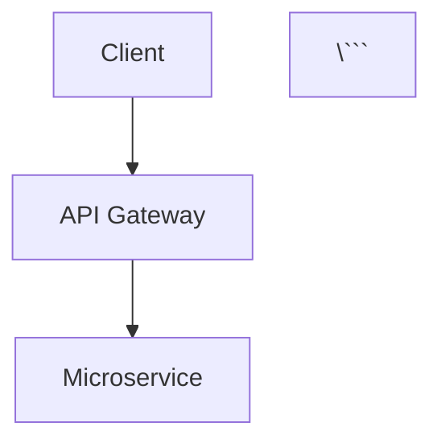

# 🏗️ Architecture Diagrams Collection

A professional collection of 50 architecture diagrams covering DevOps, Development, CI/CD, Backend, and Frontend patterns, built with Mermaid.js and hosted on GitHub Pages.


## 🚀 Live Demo

Visit the live website: [Architecture Diagrams Collection](https://your-username.github.io/architecture-diagrams)

## 📊 Diagram Categories

### DevOps (10 Diagrams)
- CI/CD Pipeline Architecture
- Kubernetes Cluster Architecture  
- Docker Container Lifecycle
- Infrastructure as Code Flow
- Monitoring Stack Architecture
- Blue-Green Deployment Strategy
- GitOps Workflow
- Multi-Cloud Architecture
- Service Mesh Architecture
- Disaster Recovery Pipeline

### Development (10 Diagrams)
- Software Development Lifecycle
- Git Branching Strategy
- Code Review Process
- Testing Pyramid Architecture
- Microservices Architecture
- Event-Driven Architecture
- Domain-Driven Design
- API Design Patterns
- Database Design Patterns
- Clean Architecture Layers

### CI/CD (10 Diagrams)
- GitHub Actions Workflow
- Jenkins Pipeline Architecture
- Azure DevOps Pipeline
- AWS CodePipeline Flow
- Feature Flag Deployment
- Multi-Environment Pipeline
- Container Security Pipeline
- Automated Testing Flow
- Rollback Strategy Diagram
- Pipeline Monitoring Setup

### Backend (10 Diagrams)
- RESTful API Architecture
- Microservices Communication
- Database Architecture Patterns
- Caching Strategy Layers
- Message Queue Architecture
- Authentication & Authorization
- Load Balancing Strategies
- API Gateway Pattern
- Data Pipeline Architecture
- Serverless Backend Flow

### Frontend (10 Diagrams)
- React Component Architecture
- Vue.js Application Structure
- Angular Architecture Pattern
- State Management Flow
- Micro-Frontend Architecture
- Progressive Web App Flow
- Frontend Build Process
- Component Design System
- Frontend Testing Strategy
- Mobile-First Responsive Design

## ✨ Features

### 🎨 Modern Design
- **Dark Theme**: Professional dark theme optimized for developers
- **Responsive**: Mobile-first design that works on all devices
- **Animations**: Smooth transitions and hover effects
- **Typography**: Clean typography with Inter and Fira Code fonts

### 🔍 Search & Navigation
- **Real-time Search**: Instant search across all diagrams
- **Category Filtering**: Filter by DevOps, Development, CI/CD, Backend, Frontend
- **Grid/List Views**: Toggle between grid and list layouts
- **Keyboard Shortcuts**: ESC to close modals, Ctrl+C to copy code

### 📱 Interactive Features
- **Modal View**: Full-screen diagram viewing experience
- **Copy Code**: One-click copy Mermaid code to clipboard
- **Fullscreen Mode**: Distraction-free diagram viewing
- **Loading States**: Elegant skeleton loaders
- **Error Handling**: Graceful error messages for failed diagrams

### 🛠️ Technical Features
- **Mermaid.js Integration**: Latest version with custom dark theme
- **Performance Optimized**: Lazy loading and efficient rendering
- **SEO Friendly**: Proper meta tags and semantic HTML
- **Accessibility**: Screen reader friendly with proper ARIA labels

## 🛠️ Local Development

### Prerequisites
- Web browser with modern JavaScript support
- Local web server (optional, for development)

### Setup Instructions

1. **Clone the repository**
   ```bash
   git clone https://github.com/your-username/architecture-diagrams.git
   cd architecture-diagrams
   ```

2. **Serve locally** (optional)
   ```bash
   # Using Python 3
   python -m http.server 8000
   
   # Using Node.js (http-server)
   npx http-server
   
   # Using PHP
   php -S localhost:8000
   ```

3. **Open in browser**
   ```
   http://localhost:8000
   ```

### Project Structure
```
architecture-diagrams/
├── index.html              # Main HTML file
├── css/
│   ├── style.css          # Main styles
│   └── mermaid-theme.css   # Mermaid custom theme
├── js/
│   ├── app.js             # Main application logic
│   ├── search.js          # Search functionality
│   └── mermaid-config.js   # Mermaid configuration
├── diagrams/              # Diagram source files (future)
│   ├── devops/
│   ├── development/
│   ├── cicd/
│   ├── backend/
│   └── frontend/
├── assets/
│   └── icons/             # Additional icons
├── _config.yml            # GitHub Pages config
└── README.md
```

## 🚀 Deployment

### GitHub Pages Setup

1. **Enable GitHub Pages**
   - Go to repository Settings → Pages
   - Source: Deploy from a branch
   - Branch: main / (root)

2. **Custom Domain** (optional)
   - Add CNAME file with your domain
   - Configure DNS settings

3. **Automatic Deployment**
   - Push to main branch triggers automatic deployment
   - Changes are live within minutes

### Custom Deployment

The website is a static site and can be deployed to any static hosting service:

- **Netlify**: Drag & drop the project folder
- **Vercel**: Connect GitHub repository
- **AWS S3**: Upload files to S3 bucket with static hosting
- **Firebase Hosting**: Use Firebase CLI
- **Cloudflare Pages**: Connect GitHub repository

## 🎯 Usage Examples

### Viewing Diagrams
1. Browse categories using the navigation filters
2. Search for specific patterns or technologies
3. Click any diagram card to view in detail
4. Use fullscreen mode for presentations

### Copying Diagram Code
1. Click the copy button on any diagram card
2. Or open the diagram modal and click "Copy Code"
3. Paste the Mermaid code into your documentation
4. Modify as needed for your specific use case

### Integration Examples

**In Markdown:**
```markdown


**In Documentation Sites:**
- GitBook
- GitLab/GitHub Wikis
- Notion
- Confluence
- Any Mermaid-supported platform

## 📈 Performance

- **Page Load**: < 3 seconds on mobile
- **Diagram Rendering**: < 2 seconds per diagram
- **Search Response**: Real-time with 300ms debounce
- **Mobile Optimized**: 95+ Lighthouse score

## 🤝 Contributing

We welcome contributions! Here's how you can help:

### Adding New Diagrams
1. Fork the repository
2. Add your diagram to the appropriate category in `js/app.js`
3. Follow the existing diagram structure:
   ```javascript
   {
       id: 'category-number',
       title: 'Diagram Title',
       category: 'category',
       description: 'Detailed description...',
       tags: ['tag1', 'tag2', 'tag3'],
       mermaid: `graph TB
           A[Start] --> B[End]`
   }
   ```
4. Test locally to ensure it renders correctly
5. Submit a pull request

### Improving Features
- Bug fixes
- Performance improvements
- New interactive features
- Better responsive design
- Accessibility improvements

### Guidelines
- Maintain consistent code style
- Test across different browsers
- Ensure mobile compatibility
- Add appropriate documentation

## 📄 License

This project is licensed under the MIT License - see the [LICENSE](LICENSE) file for details.

## 🙏 Acknowledgments

- **Mermaid.js**: For the amazing diagram rendering library
- **Font Awesome**: For the beautiful icons
- **Inter & Fira Code**: For the excellent typography
- **GitHub Pages**: For free hosting
- **The Community**: For inspiration and feedback

## 📊 Statistics

- **Total Diagrams**: 50
- **Categories**: 5
- **Technologies Covered**: 25+
- **Use Cases**: System Design, Documentation, Learning, Presentations

## 🔗 Related Resources

- [Mermaid.js Documentation](https://mermaid.js.org/)
- [System Design Primer](https://github.com/donnemartin/system-design-primer)
- [Architecture Decision Records](https://adr.github.io/)
- [Software Architecture Patterns](https://www.oreilly.com/library/view/software-architecture-patterns/9781491971437/)

## 📞 Support

- **Issues**: Use GitHub Issues for bug reports and feature requests
- **Discussions**: Use GitHub Discussions for questions and ideas
- **Documentation**: Check the README and inline code comments

---

**Made with ❤️ for the developer community**

*Share this resource with your team and help others learn system architecture!* 